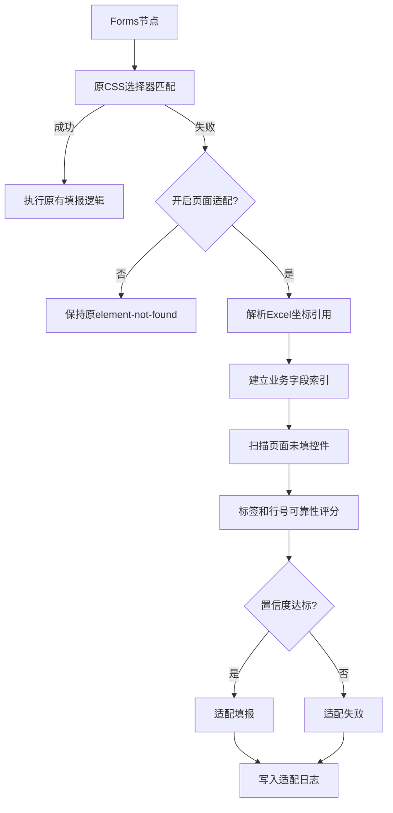

# RPA 页面适配机制与可靠性检测修改计划

## 目标边界

本次扩展不替换原有 Forms 模块逻辑，而是在 Forms 通过 CSS 选择器精准匹配失败时，增加一个可选 fallback：




核心原则：

- 默认不启用页面适配，原有 Forms 功能完全不受影响。
- 只有 CSS 精准匹配失败时才进入适配计算。
- 只匹配未填写、可编辑、可见的控件。
- 如果页面控件都已有值，则不覆盖，适配失败并写日志。
- 适配成功必须达到置信度阈值，否则不执行填报。
- 日志必须说明原选择器失败、业务字段识别依据、候选匹配依据、最终置信度。

## 现有代码基础

需要利用和修改的关键文件：

- [src/content/blocksHandler/handlerForms.js](src/content/blocksHandler/handlerForms.js)：Forms 内容脚本侧执行逻辑，当前在 `handleSelector()` 找不到元素时抛 `element-not-found`，适合作为 fallback 接入点。
- [src/content/handleSelector.js](src/content/handleSelector.js)：原 CSS/XPath 选择器匹配逻辑，应保持不变。
- [src/workflowEngine/blocksHandler/handlerInteractionBlock.js](src/workflowEngine/blocksHandler/handlerInteractionBlock.js)：后台侧会先解析 Forms 的 `{{...}}` 值，可在这里保留原始引用元数据并记录日志。
- [src/components/newtab/workflow/edit/EditForms.vue](src/components/newtab/workflow/edit/EditForms.vue)：Forms 编辑面板，可增加一个开关和阈值配置。
- [src/utils/shared.js](src/utils/shared.js)：Forms 默认数据结构，需要增加适配相关默认字段。
- [src/business/tax/schema/vatGeneralSchema.js](src/business/tax/schema/vatGeneralSchema.js)：已有主表、附表合计单元格坐标，是业务索引的静态基础。
- [src/workflowEngine/templating/mustacheReplacer.js](src/workflowEngine/templating/mustacheReplacer.js)：`{{variables@Sheet2.20.18}}` 会被解析为 `dataKey=variables`、`path=Sheet2.20.18`。

## 配置方案

采用“单个 Forms 节点分开控制”的方案，原因是改动更小、风险更低：

- 不需要新增全局设置页。
- 不影响其他普通网页表单填报。
- 只有税务申报相关 Forms 节点开启该开关。
- 失败行为仍与原节点绑定，日志也更容易定位到具体 block。

建议在 Forms 节点数据中新增字段：

```js
{
  enableAdaptiveMatch: false,
  adaptiveDomain: 'tax-vat',
  adaptiveThreshold: 0.75,
  adaptiveOnlyEmptyControls: true,
  adaptiveLogDetail: true
}
```

其中：

- `enableAdaptiveMatch`：是否启用 CSS 失败后的页面适配。
- `adaptiveDomain`：适配领域，第一版只支持 `tax-vat`。
- `adaptiveThreshold`：最低可靠性阈值。
- `adaptiveOnlyEmptyControls`：固定为 true，表示只允许匹配空控件。
- `adaptiveLogDetail`：是否记录候选评分细节。

## 业务模型索引设计

### 1. 从 `{{variables@Sheet2.20.18}}` 提取 Excel 坐标

表单输入值都是这种形式：

```text
{{variables@Sheet2.20.18}}
```

根据当前模板解析逻辑，可解析为：

```js
{
  dataKey: 'variables',
  root: 'Sheet2',
  rowIndex: 20,
  colIndex: 18
}
```

这里默认沿用项目中 `xlsx.sheet_to_json(..., { header: 1 })` 的数组坐标规则，即行列均为 0 起下标。后续展示日志时可以把列号转换为 Excel 字母列，例如 `Sheet2!S21`。

### 2. 建立 Sheet 别名到税务表的映射

根据你的前提，`Sheet2` 对应文件中的“附列资料一”。建议先建立固定映射：

```js
const VAT_SHEET_ALIAS = {
  Sheet1: '主表',
  Sheet2: '附列资料一',
  Sheet3: '附列资料二',
  Sheet4: '附列资料三',
  Sheet5: '附列资料四',
  Sheet6: '附列资料五',
};
```

当前代码中的 [src/business/tax/schema/vatGeneralSchema.js](src/business/tax/schema/vatGeneralSchema.js) 已有 `主表`、`附列资料一` 到 `附列资料四`，`Sheet6` 可先预留，避免未来扩展附表五时重构。

### 3. 静态索引：Schema 坐标到业务字段

第一层索引用已有 schema 建立：

- `META_FIELDS`：主表纳税人、所属期等基础信息。
- `MAIN_LINES`：主表第 1 到 41 栏各列数据。
- `APPENDIX1_TOTAL` 到 `APPENDIX4_TOTAL`：附表合计字段。

索引结构建议：

```js
{
  'Sheet1:20:18': {
    sheetAlias: 'Sheet1',
    sheetName: '主表',
    rowIndex: 20,
    colIndex: 18,
    fieldPath: 'lines.line11.generalCurrent',
    label: '销项税额',
    lineNo: 11,
    columnLabel: '一般项目本月数',
    source: 'schema'
  }
}
```

注意：现有 schema 只对主表字段比较完整，对附列资料只有合计字段。因此 `Sheet2.20.18` 这类附表明细坐标可能无法仅靠静态 schema 识别业务字段，需要第二层动态索引。

### 4. 动态索引：根据 Sheet 矩阵推断业务字段

为了支持 `Sheet2`、`Sheet3` 等附表中的普通单元格，应基于 `variables.Sheet2` 的二维数组动态提取上下文：

- 当前单元格所在行的文本，例如项目名称、栏次、税率、合计等。
- 当前单元格所在列的表头，例如销售额、销项税额、份数、金额、税额。
- 左侧邻近单元格，通常包含项目名称或行次。
- 上方邻近单元格，通常包含列含义。
- 是否能从同行找到“第 N 栏”“栏次 N”或数字行号。

动态索引结果示例：

```js
{
  sheetAlias: 'Sheet2',
  sheetName: '附列资料一',
  rowIndex: 20,
  colIndex: 18,
  fieldPath: 'appendix1.dynamic.r20c18',
  label: '附列资料一 第21行 第S列',
  rowText: '货物及加工修理修配劳务 ...',
  columnText: '销售额',
  lineNo: null,
  keywords: ['附列资料一', '销售额', '货物及加工修理修配劳务'],
  source: 'sheet-context'
}
```

这样即使 schema 没有完整附表明细定义，也能把 Excel 坐标转化为“可用于页面匹配的业务上下文”。

## 页面结构扫描设计

新增页面适配模块，例如：

```text
src/content/adaptiveMatch/taxVatAdaptiveMatcher.js
src/business/tax/adaptive/vatCellBusinessIndex.js
```

内容脚本侧扫描当前 document，只收集候选控件：

- `input`
- `textarea`
- `select`
- 可编辑元素 `[contenteditable="true"]`

候选控件必须满足：

- 可见：不在 `display:none`、`visibility:hidden`、尺寸为 0 的区域中。
- 可编辑：不是 `disabled`、不是 `readonly`。
- 未填写：文本框值为空、仅空白，或为税务页面默认空值 `0`、`0.0`、`0.00`；select 未选择有效值；checkbox/radio 未选中。
- 类型合适：金额类字段优先匹配 `text`、`number`、无 type 的 input。

如果扫描后没有任何未填控件，则直接返回：

```js
{
  ok: false,
  reason: 'no-empty-controls',
  message: '页面适配已启用，但当前页面所有可编辑控件均已有值，未执行自动匹配，避免覆盖已有填报内容。'
}
```

这满足“不要对已填写值的控件造成影响”的要求。

## 可靠性评分设计

对每个未填控件生成 DOM 上下文：

- `label[for]` 文本。
- 父级 `label` 文本。
- `aria-label`、`placeholder`、`title`。
- 控件 `name`、`id`。
- 同一表格行 `tr` 的文本。
- 同一表格列的表头文本；需要按 `colspan` / `rowspan` 构建表格视觉列映射，不能只用 DOM `children` 下标，否则主表“`一般项目` + `本月数`”这类合并表头会漏掉上层列组。列头提取采用同视觉列向上收集前 15 行非空单元格文本的方式，并保持页面从上到下的顺序。
- 控件前后兄弟节点文本。
- 最近容器文本。

### 标签匹配

标签匹配用于比较业务字段的 `label`、`columnText`、`keywords` 与控件上下文。

建议评分：

```text
控件label/aria/placeholder精确包含字段label：+0.35
页面同行出现字段label：+0.20
同一行或附近文本包含columnText：+0.20
页面列头匹配Excel列语义：+0.20
name/id中包含拼音、英文或约定关键字：+0.10
```

例如主表 `lines.line11.generalCurrent` 的字段标签为“销项税额”，如果页面同一行存在“销项税额”，候选 input 的可靠性会显著提高。

### 行号匹配

行号匹配主要服务主表，也可用于附表存在“栏次”的场景。

实现方法：

- 从静态 schema 识别 `lineNo`，例如 `line11` 得到 `11`。
- 从动态 Sheet 上下文中提取同行的栏次数字。
- 在页面候选控件所在 `tr` 的单元格中严格查找明确栏次，例如独立单元格 `11`、`第11栏`、`栏次11`、`11栏`；不能用整行文本里的任意数字命中，避免金额或编号误判为栏次。
- 同时结合列头，如“一般项目 / 本月数”“即征即退项目 / 本月数”“销售额”“税额”。

建议评分：

```text
页面同行出现相同栏次：+0.30
页面同行同时出现字段label：+0.20
页面列头匹配Excel列语义：+0.20
```

如果只是行号匹配但没有标签或列头支持，置信度不应过高，避免误填。

## Forms 模块接入方式

### 1. 后台侧保留原始引用元数据

在 [src/workflowEngine/blocksHandler/handlerInteractionBlock.js](src/workflowEngine/blocksHandler/handlerInteractionBlock.js) 的 Forms 值解析流程中，保留原始 `block.data.value`，并提取第一个 `{{variables@SheetX.row.col}}` 引用，放入 `block.data.adaptiveSourceRef`。

示例：

```js
adaptiveSourceRef: {
  raw: '{{variables@Sheet2.20.18}}',
  dataKey: 'variables',
  sheetAlias: 'Sheet2',
  rowIndex: 20,
  colIndex: 18
}
```

### 2. 内容脚本侧 CSS 失败后进入 fallback

在 [src/content/blocksHandler/handlerForms.js](src/content/blocksHandler/handlerForms.js) 中调整流程：

- 先按原逻辑调用 `handleSelector()`。
- 如果找到元素，继续原有 `handleFormElement()`，不进入适配。
- 如果找不到元素，判断 `data.enableAdaptiveMatch`。
- 未开启则继续抛 `element-not-found`。
- 已开启则调用税务页面适配器。
- 适配器返回元素且置信度达标后，复用原 `typeText()` 填报。

### 3. 日志记录

内容脚本无法直接写工作流日志，必须返回结构化结果给后台侧，或者在失败时把错误 `data` 附带上去，由 [src/workflowEngine/blocksHandler/handlerInteractionBlock.js](src/workflowEngine/blocksHandler/handlerInteractionBlock.js) 统一 `addLogHistory()`。

适配日志属于运行中调试诊断，不应只等到下一个模块执行或工作流结束后才可见。因此 `forms-adaptive-match` 日志需要同时设置：

```js
{
  forceSaveLog: true,
  syncRunningState: true
}
```

- `forceSaveLog`：即使工作流关闭普通日志保存，也保留适配结果，避免测试 CSS 选择器和置信度时没有诊断依据。
- `syncRunningState`：写入内存历史后立即刷新运行态，让“税务申报-主表”的运行日志面板能马上显示适配成功、失败原因和候选评分。
- 运行日志组件读取 `running.state.logs` 时要按空数组兜底，并传入 `running.state.ctxData`，避免运行态尚未刷新完整时日志区域渲染为空。

日志内容建议包括：

```js
{
  type: 'forms-adaptive-match',
  blockId,
  originalSelector,
  sourceRef: '{{variables@Sheet2.20.18}}',
  sheetAlias: 'Sheet2',
  sheetName: '附列资料一',
  rowIndex: 20,
  colIndex: 18,
  fieldLabel,
  fieldPath,
  matchedBy: ['label-text', 'row-context', 'empty-control'],
  confidence,
  reason,
  filled: true
}
```

如果所有控件已有值：

```js
{
  type: 'forms-adaptive-match',
  status: 'failed',
  reason: 'no-empty-controls',
  message: '页面适配已启用，但没有未填写的可编辑控件，已停止以避免覆盖页面已有值。'
}
```

## 实施步骤

1. 在 [src/utils/shared.js](src/utils/shared.js) 的 Forms 默认 `data` 中增加页面适配配置，默认关闭。
2. 在 [src/components/newtab/workflow/edit/EditForms.vue](src/components/newtab/workflow/edit/EditForms.vue) 增加“CSS失败后启用税务页面适配”开关，并在开启后显示置信度阈值。
3. 新增 `vatCellBusinessIndex` 模块，负责从 `{{variables@Sheet2.20.18}}`、schema 和 `variables.Sheet2` 矩阵建立业务上下文。
4. 新增 `taxVatAdaptiveMatcher` 内容脚本模块，负责扫描页面未填控件、提取 DOM 上下文、执行标签匹配和行号匹配评分。
5. 修改 [src/workflowEngine/blocksHandler/handlerInteractionBlock.js](src/workflowEngine/blocksHandler/handlerInteractionBlock.js)，在 Forms 解析值时保留 `adaptiveSourceRef`，并为适配结果写入日志。
6. 修改 [src/content/blocksHandler/handlerForms.js](src/content/blocksHandler/handlerForms.js)，在 `handleSelector()` 返回空且开关开启时调用适配器；适配成功后复用原填表逻辑。
7. 增加失败保护：无业务坐标、无未填控件、置信度不足、多个候选分数接近时都不填报，只记录日志。
8. 准备演示用例：把某个 Forms 节点的 CSS selector 故意写错，开启适配开关，证明系统能通过 Excel 坐标和页面文本找到正确空控件；再演示页面控件已有值时不会覆盖。

## 风险与处理

- 附表明细字段缺少静态 schema：通过动态 Sheet 上下文补足标签和列头信息。
- 页面文本过少导致误匹配：设置最低阈值，并要求至少命中标签、行号、列语义中的两类证据。
- 所有控件已有值：直接失败，不覆盖。
- 多个候选分数接近：返回 `ambiguous-match`，要求用户更新 CSS selector 或降低风险后手动处理。
- 普通网页 Forms 被影响：默认关闭，只有单个 Forms 节点开启时才生效。

## 论文可展开内容

这一扩展可以作为“页面适配机制设计与可靠性检测”章节，重点写：

- 基于 CSS 选择器的精准匹配局限性。
- 基于 Excel 坐标的税务业务字段反向索引。
- 静态 schema 与动态 Sheet 上下文结合的业务字段识别方法。
- 只匹配未填控件的安全保护策略。
- 基于标签、行号、列语义和控件状态的可靠性评分模型。
- 适配过程日志与可解释性设计。

